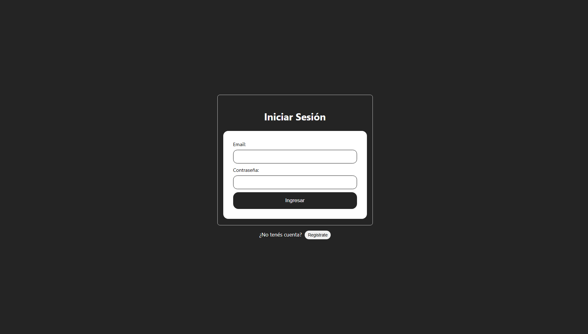
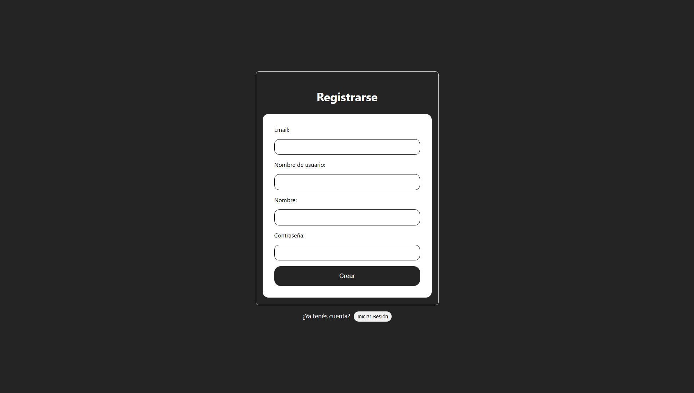

# Sistema de Login y Registro Con Roles (Node.js, Express, React, MySQL)

Este es un proyecto de práctica en React, Node.js, Express y MySQL en el que practiqué conceptos fundamentales de roles, seguridad, patrónes de diseño MVC, componetización y más. El código es libre de descargar y utilizarlo para sus propios fines.

## Como Ejecutar
Primero, clone el repositorio:

`git clone https://github.com/damistydesign/LoginRegistroApp.git`

Luego navegue hasta el directorio y ejecute:

`npm run install:all`

Esto instalará tanto las dependencias del Back-End, como del Front-End. Luego, en su motor de SQL, ejecute las instrucciones en el fichero `db.sql`.

Cree y personalice sus configuraciones especificas en los `.env` de la carpeta raíz y del `frontend` (en esta ultima puede dejarlo por defecto si ejecutará en **localhost**)

Una vez realizado, puede ejecutar `npm run dev` para ejecutar simultaneamente tanto el **Back-End** como el **Front-End**. El **Back-End** por defecto se inicializará en el puerto **3000** , y el **Front-End** al usar **Vite** utilizará el puerto **5173**.

## Características Principales:

- 🔐 **Autenticación Robusta**: Login y Registro seguro con hash de contraseñas (Bcrypt).

- 🎟️ **Sesiones con JWT**: Protección de rutas privadas mediante JSON Web Tokens.

- 🛡️ **Validaciones**: Control de datos de entrada tanto en Frontend (HTML5) como en Backend (Zod).

- 👑 **Sistema de Roles**: Renderizado condicional y permisos para usuarios Administradores.

- 📂 **Arquitectura Escalable**: Estructura de Monorepo con separación de responsabilidades (MVC).

## Requisitos:

* Node.js (v16 o superior)

* MySQL Server

---
## Tecnologías utilizadas
* React (Vite)
* Node.js
* Express
* Dotenv
* MySQL  *(Driver MySql2)*
* Bcrypt
* CORS
* ZOD
* JSONWebToken
* JWTDecode

**Programado Por:** [Damián Rosano](https://github.com/damistydesign)
